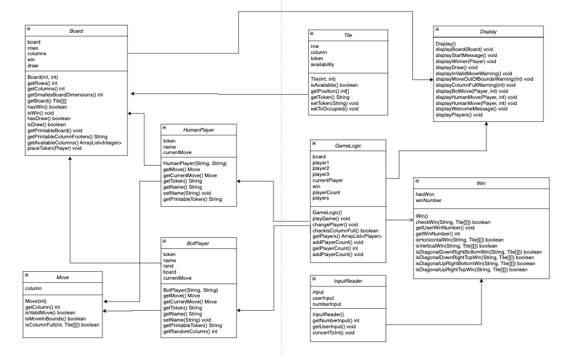
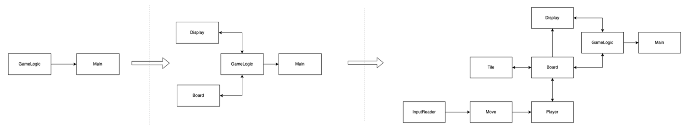
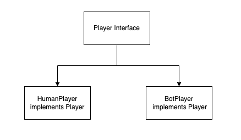

# connect4-game

## Final assignment for Principles of programming course at the University of Bath

### Principles of programming – connect4 OOP restructuring report 

Task: Re-factor source code of connect4 game to be structured in an OOP way.

Introduction:

This report provides an outline of how one could restructure the source code of the connect4 java code in an OOP fashion, provided by the final assignment of the Principals of Programming course at the University of Bath. The report begins by indicating how the existing code could be borken up into separate modules, after which an indication of each OO principle is described and commented on in relation to the assigned code and whether it would be appropriate to use in certain situation or not.
OOP principles:

1.	Modularization

Currently the code base is not very modular, there are  plenty of repeated patterns of behavior. Firstly, the current code base consists of two files, Main.java where the program is run and MyConnectFour.java, which consists of all the logic for the game. If the goal is to create an object-oriented version of this code, we need to adhere to the modularization principle which is the process of grouping related data and procedures or methods that acts on this data together. Using an OOP approach to this project makes sense because we can think of this game as a set of objects, interacting with each other, all consisting of data that determines their states, as well as behavior that either changes or updates their respective states, or has influence on other objects’ states. Therefore establishing what Classes we need is the first step in modularization. 

Figure 1 demonstrates a diagram that illustrates this idea where instead of having the Game logic all in in one MyConnectFour.java, we can begin by separating the into separate modules: A Display class dedicated to encapsulating reusable messages to be printed to the user, a Board class the takes care of the state of the board and updating it. There is no end to complexity when it comes to OO programs, we can break up the logic further into more classes that can take care of other parts of the MyConnectFour.java code such as a Player class, with data or class members like, name, token, and methods like getMove() . Other examples could include a separate Tile class that is dedicated to storing data on the availability of each tile on the board as well as methods that occupy() certain tiles in a Board instance. A Move class that can handle the data of the players Move during game play. With methods to perform data validation on said moves like isValidMove(). A Win class that keeps track of whether the game has been won and contains methods that check if, given a valid Move, whether the game has been won. Finally, we could use a separate InputReader class that would handle the data on the user input from the command line with methods that ensure correct user input and data validations, such as ensuring that the user has inputted a character that is can be parsed into an integer such as with a method convertToInt().

2.	Abstraction and Encapsulation

Abstraction is the process of taking a functionality or a procedure and generalizing it, by making some implementation applicable to different types of data. In order to do this, the process of Encapsulation is used in order to take some logic and wrap it around a method in order to increase the modularity of the code and allowing for the reuse of this functionality. Below in figure 2, is an example of this in the MyConnectFour.java. In figure 1, currently, to check if a player won the game by connecting 4 horizontally, the code checks if first player 1 satisfies the win clause, then using the same code further down to check if player 2 wins. 
This can be abstracted by Encapsulating the functionally in which one could wrap this piece of code into a single method that checks if any player wins horizontally. Furthermore we can abstract  the winning behavior further thereby generalizing the winning conditions in which, as demonstrated in figure 3, one could create several smaller methods that check horizontal, vertical and diagonal wins into one wrapper method that Encapsulates all these sub routines for checking the various win conditions. This could be called checkWin(). 
3.	Coupling

This is a measure of how dependent sections of the code base are to each other. If a class relies heavily on functionality of another class in order for it to exist, this suggests that these classes are tightly coupled. Therefore, changing the functionality of one class might have large ramifications for the other. In the case of the initial connect4 code base, everything is completely coupled together in a procedural way. This goes against good OOP principles of software design where we want classes and interfaces to be as loosely coupled as possible; in separate classes, making the possibility for the extension of changing of functionality easier without breaking other parts of the code and accruing more technical debt. Therefore, creating separate classes for different behaviors and data would be the way to do this for the OOP restructuring. 

4.	Cohesion
Cohesion is the measure of diversity of tasks that any given piece of code, class, method might have. This essentially means the higher the cohesion of a piece of software, the more the constituent parts of a given unit work together to achieve the common goal that justifies the existence of said unit in the first place. High cohesive class design in OOP is the goal, where each class has a dedicated, ideally single, purpose and each individual member and method are strictly related to this single purpose. For example, our GameLogic class should not also be dedicated to displaying the board and dealing with user input from the command line, as shown in figure 4. The Gamelogic class should only be concerned with the game play and that sequence of procedures. A separate class dedicating to displaying the states of a game and a separate class dedicated to handling user input would be the way to go. This would result in a set of modules with High cohesion.

5.	Inheritance, abstract classes, Interfaces
Inheritance is a powerful feature in OOP where one can define a hierarchy of classes, where sub-classes can inherit fields and methods from a super-class. Inheritance is only one way, meaning that a sub-class can only inherit things from a super-class, not vice-versa. For this project, there is a good use case for Inheritance when it comes to the Player class. Reading a little bit ahead, it seems likely that there will be different types of players, namely one computer player and one human player. These two entities will share common behavior, but the implementation of these behaviors will be very different. Concretely, one could have the following hierarchy shown in figure 5.
I believe for this type of hierarchy; it would make sense to either use an Interface or an Abstract class rather than a regular Class. The reason being is that we need an higher object that gives the blueprint of a behavior rather than explicitly implementing this behavior. The reason for this is that one would want to implement the same method signatures but override them with custom behavior depending on the class specifications. In the case of the Player, I would use a simple Interface to design a contract, that dictates that the class that implement this Interface would need to subsequently implement all the methods signatures of the Player Interface as indicated in Figure 5.

The reason I would use an Interface rather than an Abstract Class is not because it is the perfect choice, one could use either. It might technically be even better to use an Abstract Class since all sub-classes of the hypothetical Player abstract class would have fields in common. This would suggest a generalization of a type of behavior with common features that could be passed down to from the Player super class to the HumanPlayer and BotPlayer sub-classes e.g. the name and token fields. However, given that these are rather simple objects, the Interface seemed good enough as one would essentially be able to standardize the behavior of all the implemented classes, not needing the verbose constructors with the super keyword that might make extended classes hard to read. In addition, the key advantage in using Interfaces in this case is that classes can implement as many interfaces as they want, giving plenty of flexibility to the Player sub-classes, where functionality can easily be extended, with no modifications necessary to the already created classes. 

6.	Polymorphism
We can take advantage using Polymorphism in the Player class by using method dispatching to dispatch the correct method depending on the type of Player that is currently playing the game. Below is an example of this where depending on whether the player is a HumanPlayer or BotPlayer the method getMove() will return a Move object, however, the way in which this Move object is returned will be different, yet this is encapsulated and not of concern to the person using the API.

